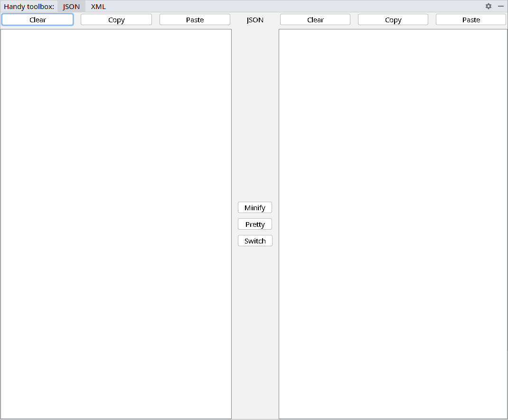

# Handy toolbox
IntelliJ Idea plugin to minify and make pretty json or xml data structure

**Requirements:**

- Java 11
- IntelliJ Idea 2019+ (IC, IU)

**Plugin screenshot:**

### How to build plugin

**Linux:**

1. Open terminal
1. Move to plugin project source directory
1. Execute gradle task `./gradlew buildPlugin`

### How to install plugin

1. Build plugin
1. Run IntelliJ Idea
1. Click `File` menu
1. Choose `Settings..` at submenu
1. Choose `Plugins` at Settings window
1. Click on the gear icon at plugins window
1. Choose `Install Plugin from Disk...`
1. Find built plugin at disk (File's plugin name looks like `handy toolbox-1.0.0.zip`)  
1. Choose file and click Ok at Choose plugin file window
1. Click `Restart IDE` beside handy toolbox plugin name

### UI elements description

- Left pane is input one.
- Right pane is output one.
- Action buttons are placed between pane. Each button perform operation on input pane content and place result to output pane.
- Service action buttons are placed above each pane. Each button works only with pane below it.  

### How to use plugin

1. Choose required tool at tool window header
1. Paste or print data structure to input pane
1. Click on required action button.

### Restriction

- Text size is restricted by 20 mb.